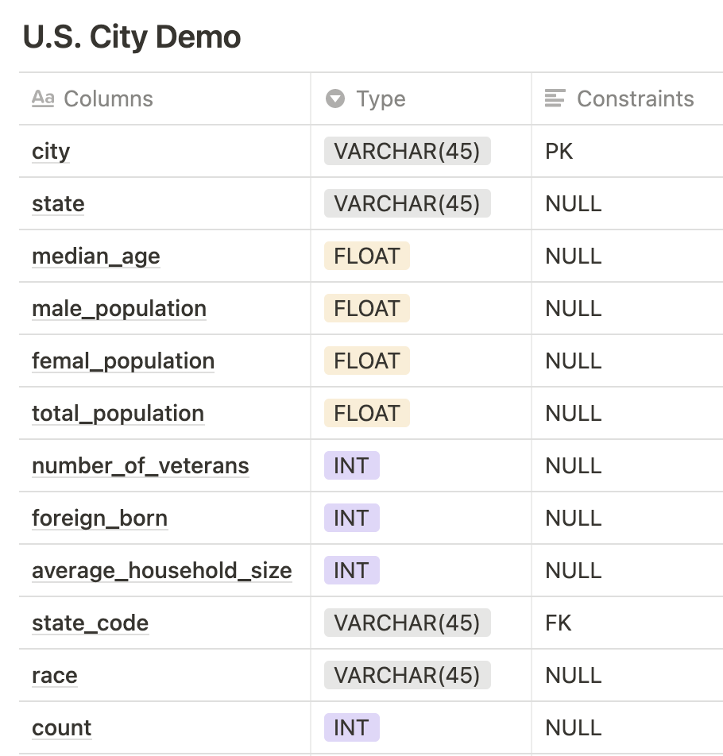
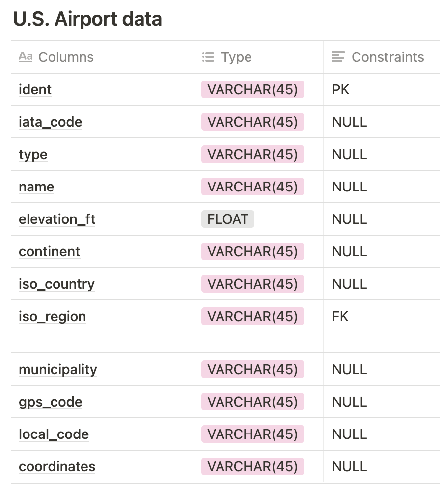
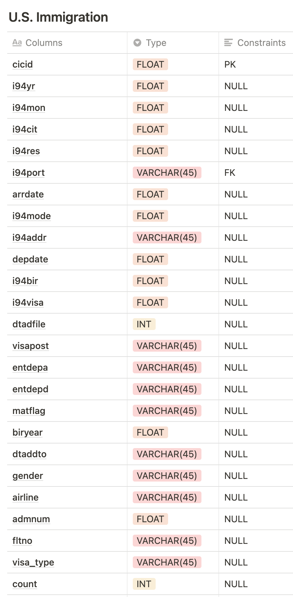
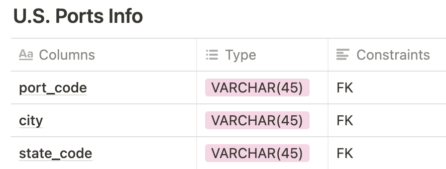

# Project Summary

The objective of this capstone project is to build ETL pipeline for I94 immigration, US City Demographics, US Airports, and US port code datasets to create database tables for analytical purposes. With those data tables, Data Analysts can provide insights to the regulators to keep track of immigrants and their immigration informations. For examples, we could find answers to the questions such as, Which is the main characteristics of the city that are popular to the particular immigrants?

## Data and Code
 ### Data Sets
 All datasets are located in local workspace. 
 * !!Notice!! : Because I was unable to access to saurfang's spark-sas7bdat - error : "Java gateway process exited before sending its port number"
 * Reference - Mentor's help : https://knowledge.udacity.com/questions/572487

- immigration_data_sample.csv : 
- sas_data : immigration_data_sample.csv file was used as alternatives.
- us-cities-demographics.csv : 
- airports-codes_csv.csv : 
- I94_SAS_Labels_Description.SAS : 

 ### Codes
- Capstone Project Template.ipynb : Key run file of this projects. Which reads from local workspace(or your repository), and clean data, create Spark Sessions and execute SQL queries to build data models and writes analytical database into AWS S3.
- sql_queries.py : Necesarry queries to build data model and 
- utilities.py : Some functions to help EDA and data cleansing for datasets.
- config.cfg - contains configuration that allows the ETL pipeline to access AWS EMR cluster.

## Prerequisites
- AWS EMR cluster
- Apache Spark
- configparser python 3

## The project follows the following steps:
Step 0: Codes import that necessary
Step 1: Scope the Project and Gather Data
Step 2: Explore and Assess the Data
Step 3: Define the Data Model
Step 4: Run ETL to Model the Data
Step 5: Complete Project Write Up
Step 1: Scope the Project and Gather Data

## Project Scope

### Step 1: Scope the Project and Gather Data
To create the analytics database, the following steps will be carried out:

1. Perform EDA of each datasets to find missing values, duplicates and any data quality problems.
2. Create dimesion and fact tables using SparkQL and AWS EMR clusters and then write tables into parquet file to the AWS S3 bucket.
  - create Immigration fact table from the I94 immigration dataset
     * In this project, I used 'sample csv file' due to an issue from access to 'saurfang:spark-sas7bdat' file through this local workspace
  - create Us City Demographics dimension table from the us-cities-demographics dataset. This table can be joined with other tables through the state code field.
  - create Us Airport codes dimension table from the airport-code dataset. This table can be joined with other tables through the iata code field.
  - create Port Info dimension table from I94_SAS_Labels_Descriptions text file. This table contains state code and iata code to each city name. 
 
3. To build this ETL pipeline, AWS S3 / AWS EMR cluster and Spark were used in this project. 

4. To run this ETL pipeline, user just run this ipynb file step by step.

### Step 2: Explore and Assess the Data
Identify data quality issues, like missing values, duplicate data, etc.
And elaborate some columns to build model that can be foreign key
 - 1) Check missing values and drop if necessary
 - 2) Check duplicated rows and drop if necessary
 - 3) Clean columns and values if necessary
     - Change value type
     - Change upper cases to low cases or vice versa
 - 5) Elaborate Columns that could be used as foreign key
 
Step 3: Define the Data Model
|U.S. City Demo|U.S. Airport|U.S. Immigration|U.S. Port Info|
|--------------|--------------|--------------|--------------|
|||||

### Step 3: Mapping Out Data Pipelines
List the steps necessary to pipeline the data into the chosen data model

1. Create tables through running create_tables.py
        1) create us city demographic dimension table
        2) create us airpot dimension table
        3) create us immigration fact table
        4) create us port infomation dismension table
2. Insert 

|U.S. City Demo|U.S. Airport|U.S. Immigration|U.S. Port Info|
|--------------|--------------|--------------|--------------|
|||||

### Step 4: Run ETL to Model the Data

1) Creating Spark Session is already done before.
2) Processing read and extract, load Immigration(Sample) file 
3) Processing read and extract, load US demographic file 
4) Processing read and extract, load US airport file 
5) Processing read and extract, load portinfo file 
6) The data quality checks ensures that the ETL has created fact and dimension tables with expected records without errors.

#### Step 5: Complete Project Write Up

1. Rationale for the choice of tools and technologies for the project
 - 1) Apache Spark
      - Able to handle multiple file formats and lightning-fast unified analytics engine for Big Data.
      - Spark has easy-to-use APIs for operating on large datasets
  
  
2. Propose how often the data should be updated and why.
  - Our Fact table, I94 Immigration data is updated by monthly, so we have to monthly append procedure into our database

3. Write a description of how you would approach the problem differently under the following scenarios:
 - 1) The data was increased by 100x.
    - Still Apache Spark can handle multiplied data scale. But We have to consider add more nodes to our EMR clusters.
 - 2) The data populates a dashboard that must be updated on a daily basis by 7am every day.
    - To monitor and manage each ETL process and trouble shooting, Apache Airflow would be solution.
 - 3) The database needed to be accessed by 100+ people.
    - In this scenario, we would move our analytics database into Amazon Redshift.
